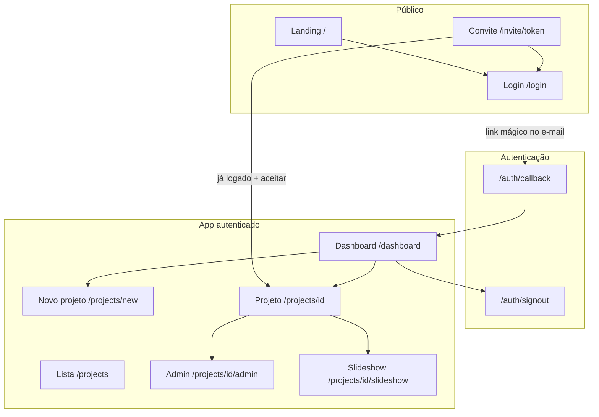
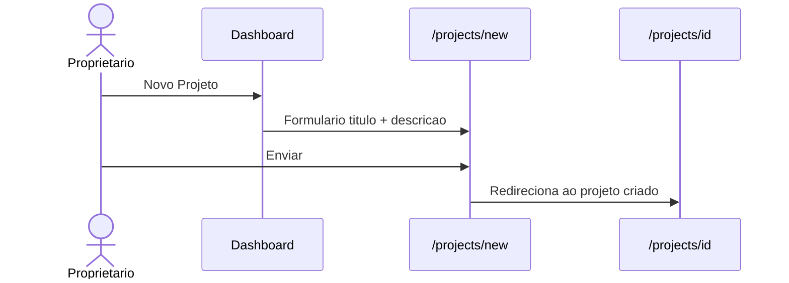

# Storyloom — Fluxos de Usuário

Este documento descreve os caminhos que cada tipo de usuário percorre no Storyloom: da primeira visita até convites, galeria, apresentação e exportação. Use-o para onboarding de família, testes manuais e revisão de produto.

**Produção:** https://depoimentos-eight.vercel.app  
**Rotas públicas:** `/`, `/login`, `/invite/[token]`  
**Rotas protegidas:** `/dashboard`, `/projects/*` (exige login)

---

## Papéis no projeto

| Papel | Como obtém | O que pode fazer |
|-------|------------|------------------|
| **Proprietário** | Cria o projeto | Tudo: editar/excluir projeto, convites, upload, comentários, ver fotos pendentes, painel admin, export ZIP |
| **Colaborador** | Convite com papel *Colaborador* | Ver fotos aprovadas, enviar fotos, comentar |
| **Visualizador** | Convite com papel *Visualizador* | Ver fotos aprovadas e comentários; não envia fotos |
| **Administrador** (colaborador) | Convite com papel *Administrador* | Como colaborador, com permissões estendidas no projeto (upload + comentários) |

O proprietário é sempre o usuário que criou o projeto (`owner_id`). Papéis de convite mapeiam para entradas em `project_collaborators`.

---

## Visão geral



---

## 1. Visitante → primeiro acesso

**Objetivo:** conhecer o produto e entrar sem senha.

| Passo | Onde | O que acontece |
|-------|------|----------------|
| 1 | `/` | Landing com explicação, “Começar” ou “Entrar” |
| 2 | `/login` | Formulário de e-mail (link mágico) |
| 3 | E-mail | Usuário clica no link do Supabase |
| 4 | `/auth/callback` | Código trocado por sessão; redireciona para `redirectTo` ou `/dashboard` |
| 5 | `/dashboard` | Lista de projetos (vazia na primeira vez) |

**Detalhes importantes**

- Não há senha: apenas OTP / magic link.
- Se o link cair em `/?code=...`, o middleware redireciona para `/auth/callback`.
- `redirectTo` seguro preserva destinos como `/invite/[token]` após o login.
- Na primeira entrada, o trigger SQL cria uma linha em `profiles` automaticamente.
- Sem `.env` Supabase: landing e login mostram instruções; rotas protegidas redirecionam para login com erro de configuração.

**Empty state:** dashboard mostra “Nenhum projeto ainda” com CTA para criar o primeiro.

---

## 2. Proprietário — criar e gerenciar projeto

**Objetivo:** abrir um espaço privado para a história da família.



| Passo | Rota | Ação |
|-------|------|------|
| 1 | `/dashboard` | Clicar **Novo Projeto** |
| 2 | `/projects/new` | Preencher título (obrigatório) e descrição (opcional) |
| 3 | `/projects/[id]` | Página principal do projeto: convites (dono), upload, galeria |

**Edição e exclusão (só proprietário)**

| Ação | Rota / UI |
|------|-----------|
| Editar título/descrição | `/projects/[id]/edit` |
| Excluir projeto | Botão na página do projeto (confirmação) |
| Administração | `/projects/[id]/admin` |

---

## 3. Proprietário — convidar família

**Objetivo:** trazer parentes ao projeto com um link seguro.

| Passo | Onde | O que acontece |
|-------|------|----------------|
| 1 | `/projects/[id]` | Seção **Convidar família** (só dono) |
| 2 | Formulário | Escolhe papel, e-mail opcional (só informativo), validade (dias) |
| 3 | **Gerar link de convite** | Server Action cria token UUID; link copiado para área de transferência |
| 4 | WhatsApp / e-mail | Dono envia o link manualmente |
| 5 | `/invite/[token]` | Convidado vê projeto, papel e validade |

**Estados do convite na lista do dono**

- **Ativo** — pode ser usado até `expires_at`
- **Usado** — `redeemed_at` preenchido
- **Expirado** — passou da data de validade
- Dono pode **copiar** ou **revogar** links ativos

**Requisito:** `SUPABASE_SERVICE_ROLE_KEY` no servidor para resgate do convite após login.

**Empty state:** “Nenhum convite ainda” até o primeiro link ser gerado.

---

## 4. Convidado — aceitar convite (fluxo simplificado)

**Objetivo:** permitir que o convidado aceite o convite e acesse o projeto com o mínimo de fricção possível (idealmente sem login em duas etapas).

```mermaid
flowchart TD
    Start[Clica no link do convite<br/> /invite /token] --> Valid{Convite válido?}

    Valid -->|Não| Expired[Mostrar: Convite expirado ou já usado]
    Valid -->|Sim| Logged{Usuário logado?}

    Logged -->|Não| Login[Tela: Entrar e Aceitar Convite]
    Login --> Magic[Envia Magic Link<br/>com invite token no redirect]
    Magic --> Callback[/auth /callback?invite=token]
    Callback --> AutoAccept[Auto-aceitar convite]
    AutoAccept --> AddMember[Adicionar como colaborador]
    AddMember --> Project["/projects /id — direto ao projeto"]

    Logged -->|Sim| Member{É membro do projeto?}
    Member -->|Sim| Project
    Member -->|Não| AcceptScreen[Tela: Aceitar Convite]
    AcceptScreen --> ClickAccept[Clica em Aceitar Convite]
    ClickAccept --> AddMember

    Project --> Session[Sessão mantida via cookies]
    Session --> Future[Próximas visitas abrem direto<br/>se estiver logado]
```

| Situação | O que acontece |
|----------|----------------|
| **Não logado**, convite válido | `/login?invite={token}` → magic link com `/auth/callback?invite={token}` → **aceite automático** → `/projects/{id}` |
| **Logado**, ainda não é membro | Uma tela com botão **Aceitar convite** (único clique extra) |
| **Já é membro** | Link **Ir para o projeto** |
| **Dono logado** no próprio convite | Aviso para sair e entrar com outro e-mail |
| **Convite inválido** | 404, expirado ou já usado |
| **Falha no auto-aceite** | Retorno a `/invite/{token}?error=...` com mensagem |

**Implementação:** resgate atômico via RPC `redeem_project_invite` (service role). Se o dono preencheu e-mail no convite, só esse endereço pode aceitar. Quem já está logado continua com aceite explícito via `InviteAcceptForm`.

Após aceite: linha em `project_collaborators` com o papel do convite; sessão persiste para visitas futuras.

---

## 5. Colaborador / visualizador — ver e contribuir

**Objetivo:** participar da história conforme o papel.

### Galeria (`/projects/[id]`)

| Passo | Comportamento |
|-------|----------------|
| Abrir projeto | Badge com papel (Colaborador, Visualizador, etc.) |
| Galeria | Grade de fotos **aprovadas** (dono também vê pendentes) |
| Busca | Filtra por título, legenda ou história |
| Toque na foto | Modal com imagem, metadados e comentários |
| Apresentação | Overlay na mesma página ou **Tela cheia** em `/projects/[id]/slideshow` |

**Upload (colaborador, admin ou dono — não visualizador)**

| Passo | UI |
|-------|-----|
| 1 | Painel **Adicionar fotos** |
| 2 | Escolher uma ou várias imagens (JPEG, PNG, WebP, GIF, HEIC) |
| 3 | Opcional: título, legenda, história por foto |
| 4 | **Enviar** → fotos na galeria (aprovadas por padrão; dono pode moderar) |

**Comentários (no modal da foto)**

| Ação | Quem |
|------|------|
| Ler comentários | Membros do projeto |
| Adicionar comentário | Membros; em fotos não aprovadas, só o dono |
| Editar / excluir próprio comentário | Autor do comentário |
| Excluir qualquer comentário | Dono (via admin) |

**Empty states**

- Galeria vazia: orienta a usar o painel de upload acima.
- Busca sem resultado: “Limpar busca”.
- Comentários: “Seja o primeiro a compartilhar uma memória”.

---

## 6. Apresentação de slides (slideshow)

**Objetivo:** reviver memórias em tela cheia, especialmente no celular.

**Entradas**

- Botão **Apresentação** na galeria (overlay)
- Link **Tela cheia** → `/projects/[id]/slideshow` (rota dedicada)
- Dentro do modal da foto → abrir apresentação na foto atual

**Controles**

| Plataforma | Navegação |
|------------|-----------|
| Desktop | Setas ← →, Espaço (legenda/comentários), Esc (sair) |
| Mobile | Deslize horizontal (Embla); botão play/pause para auto-avanço |
| Todos | Ícone ℹ️ abre painel inferior com legenda, história e comentários |

**Comportamento**

- Auto-avanço opcional (pausa ao interagir ou com painel de info aberto)
- Indicadores de slide (até 20 fotos)
- Comentários na apresentação são somente leitura; para comentar, voltar à galeria

**Empty state (rota dedicada sem fotos):** mensagem + voltar ao projeto.

---

## 7. Proprietário — administração e moderação

**Rota:** `/projects/[id]/admin` (somente dono; outros são redirecionados à galeria)

### Export ZIP

| Passo | Ação |
|-------|------|
| 1 | Selecionar fotos (checkbox por foto ou “selecionar todas”) |
| 2 | **Exportar N fotos** |
| 3 | Download de ZIP com imagens + `MEMORIES.md` + `memories.json` |

**Limites:** até 100 fotos, ~200 MB total, 10 exportações por usuário por hora.

### Fotos e comentários

- Lista hierárquica: cada foto expansível com comentários aninhados
- Aprovar / rejeitar foto pendente
- Editar título, legenda, história
- Remover foto ou comentário
- Badges: fotos aguardando aprovação, total de comentários

### Colaboradores

- Lista com nome e data de entrada
- Alterar papel (colaborador / visualizador / admin)
- Remover colaborador do projeto

**Empty states:** sem fotos ou sem colaboradores — orientações para upload e convites na página principal do projeto.

---

## 8. Sair da conta

| Passo | Onde |
|-------|------|
| 1 | Header do app → **Sair** |
| 2 | `POST /auth/signout` | Encerra sessão Supabase |
| 3 | Opcional `?redirectTo=` | Ex.: sair e voltar ao convite com outro e-mail |

---

## 9. Fluxos de erro e borda (referência rápida)

| Cenário | Experiência |
|---------|-------------|
| Supabase não configurado | Login explica `.env.local`; rotas protegidas bloqueadas |
| Magic link inválido | `/login?error=auth_failed` |
| Projeto inexistente / sem acesso | 404 |
| Imagens não carregam | Aviso para configurar `SUPABASE_SERVICE_ROLE_KEY` (signed URLs) |
| Convite sem service role | Aviso na página do convite e no painel de convites |
| Vercel Deployment Protection | Visitante vê login Vercel antes do app — desativar em produção |
| URL de app incorreta | Links mágicos/convites quebram — alinhar `NEXT_PUBLIC_APP_URL` e Supabase Redirect URLs |

---

## 10. Checklist de teste manual (mobile)

Use este roteiro em um celular ou viewport estreita:

1. [ ] Landing legível; botão **Começar** leva ao login  
2. [ ] Magic link completa e cai no dashboard  
3. [ ] Criar projeto → empty state da galeria → upload de 1 foto  
4. [ ] Toque na foto → modal → comentário  
5. [ ] Apresentação: deslize, painel de info, fechar  
6. [ ] Gerar convite → abrir em aba anônima → login → aceitar → ver galeria  
7. [ ] Admin: aprovar/rejeitar, exportar ZIP (com service role)  
8. [ ] Sair e entrar com outro e-mail  

---

## Mapa de rotas

| Rota | Autenticação | Descrição |
|------|--------------|-----------|
| `/` | Não | Landing |
| `/login` | Não* | Link mágico (*redireciona se já logado) |
| `/auth/callback` | Troca de código | Pós-clique no e-mail |
| `/auth/signout` | POST | Encerrar sessão |
| `/dashboard` | Sim | Projetos do usuário |
| `/projects` | Sim | Lista alternativa de projetos |
| `/projects/new` | Sim | Criar projeto |
| `/projects/[id]` | Sim | Hub: convites, upload, galeria |
| `/projects/[id]/edit` | Sim (dono) | Editar metadados |
| `/projects/[id]/admin` | Sim (dono) | Moderação + export |
| `/projects/[id]/slideshow` | Sim | Apresentação dedicada |
| `/invite/[token]` | Não** | Aceite de convite (**aceitar exige login) |
| `/api/projects/[id]/export` | Sim (dono) | Download ZIP |

---

Documento alinhado ao código em `app/`, `components/` e `lib/`. Para setup e deploy, veja [README.md](./README.md).